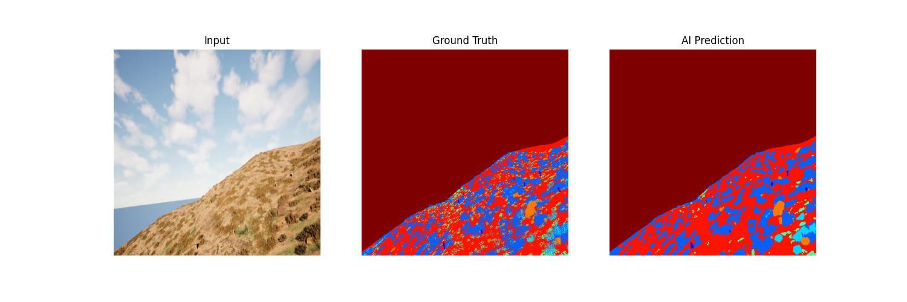
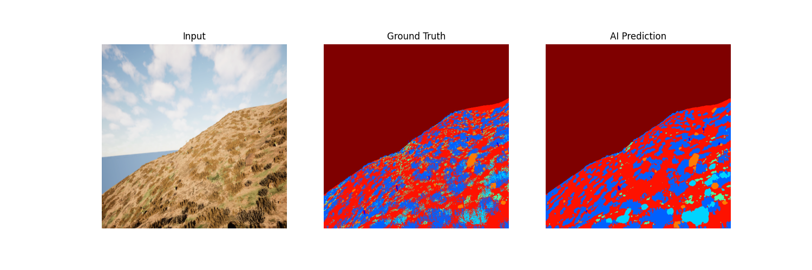
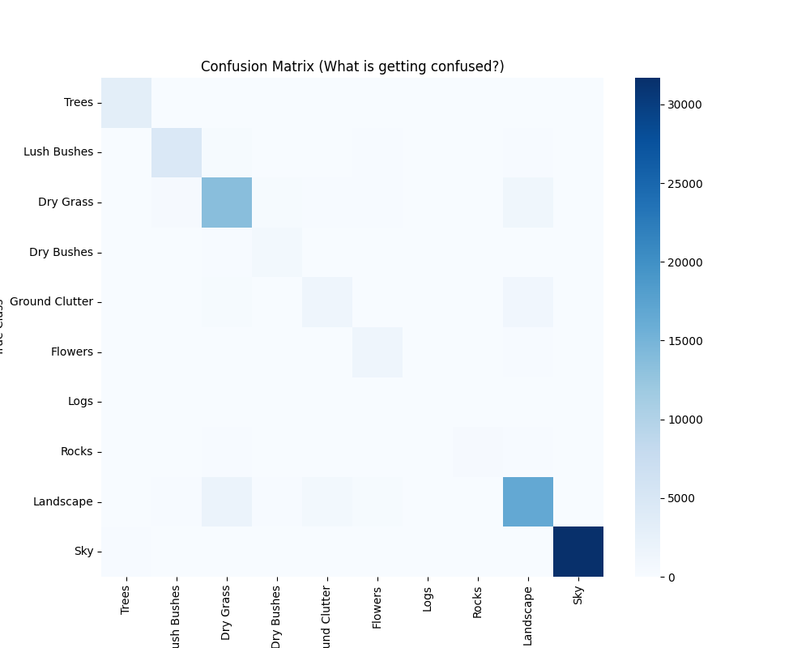

# 🏜️ Offroad Environment Segmentation AI

> **Semantic segmentation model for autonomous offroad navigation in desert terrain.**
>
> Built for the **Startathon Desert Hackathon** — classifies every pixel of a terrain image into one of 10 environmental categories to enable safe autonomous offroading.


---

## 📸 Demo

<!-- Replace with actual screenshots from your final_submission_results/ folder -->
| Input Image | Ground Truth | AI Prediction |
|:-----------:|:------------:|:-------------:|
|  | — | — |
|  | — | — |

---

## 🧠 Model Architecture

| Component | Details |
|-----------|---------|
| **Architecture** | U-Net |
| **Encoder** | ResNet-34 (ImageNet pretrained) |
| **Framework** | [segmentation-models-pytorch](https://github.com/qubvel/segmentation_models.pytorch) |
| **Input Resolution** | 512 × 512 |
| **Output Classes** | 10 |
| **Loss Function** | CrossEntropy + Dice (hybrid) |
| **Optimizer** | Adam (LR: 1e-5 for fine-tuning) |
| **LR Scheduler** | Cosine Annealing |
| **Augmentation** | Horizontal flip, Vertical flip |

---

## 🏷️ Class Definitions

| Class ID | Raw Pixel Value | Class Name | Color |
|:--------:|:---------------:|------------|:-----:|
| 0 | 100 | Trees | 🟩 `#228B22` |
| 1 | 200 | Lush Bushes | 🟢 `#9ACD32` |
| 2 | 300 | Dry Grass | 🟨 `#DAA520` |
| 3 | 500 | Dry Bushes | 🟫 `#8B4513` |
| 4 | 550 | Ground Clutter | ⬜ `#808080` |
| 5 | 600 | Flowers | 🩷 `#FF69B4` |
| 6 | 700 | Logs | 🟤 `#A0522D` |
| 7 | 800 | Rocks | ⬛ `#696969` |
| 8 | 7100 | Landscape | 🟧 `#F4A460` |
| 9 | 10000 | Sky | 🔵 `#87CEEB` |

---

## 📊 Performance Metrics

### Overall

| Metric | Score |
|--------|------:|
| **Pixel Accuracy** | `<PIXEL_ACCURACY>`% |
| **Mean IoU** | `<MEAN_IOU>`% |

### Per-Class IoU

| Class | IoU |
|-------|----:|
| Trees | `<IOU_TREES>`% |
| Lush Bushes | `<IOU_LUSH_BUSHES>`% |
| Dry Grass | `<IOU_DRY_GRASS>`% |
| Dry Bushes | `<IOU_DRY_BUSHES>`% |
| Ground Clutter | `<IOU_GROUND_CLUTTER>`% |
| Flowers | `<IOU_FLOWERS>`% |
| Logs | `<IOU_LOGS>`% |
| Rocks | `<IOU_ROCKS>`% |
| Landscape | `<IOU_LANDSCAPE>`% |
| Sky | `<IOU_SKY>`% |

### Confusion Matrix



---

## 📂 Project Structure

```
desert_hackathon/
├── app.py                    # Streamlit web app for live inference
├── best_model.pth            # Trained model weights (~93 MB)
├── requirements.txt          # Python dependencies
│
├── run_training.py           # V0 — Baseline training script
├── local_train.py            # V1 — Local GPU training
├── local_train_v2.py         # V2 — Fixed mask ID mapping
├── local_train_v3.py         # V3 — Augmentation + hybrid loss + scheduler
├── local_train_final.py      # V4 — 512×512 high-res fine-tuning
│
├── check_model.py            # Quick single-image visual check
├── accurate_check.py         # Corrected mask reading validation
├── check_iou.py              # Full validation set IoU computation
├── check_split.py            # Train/val split ratio verification
├── final_test.py             # Final eval: IoU + confusion matrix + visuals
│
├── final_submission_results/ # Generated evaluation outputs
│   ├── confusion_matrix.png
│   └── result_0..4.png
│
└── Offroad_Segmentation_Training_Dataset/   # (gitignored)
    ├── train/
    │   ├── Color_Images/
    │   └── Segmentation/
    └── val/
        ├── Color_Images/
        └── Segmentation/
```

---

## 🚀 Getting Started

### Prerequisites

- Python 3.8+
- NVIDIA GPU with CUDA support (tested on RTX 4050 — 6 GB VRAM)

### Installation

```bash
git clone https://github.com/<YOUR_USERNAME>/desert_hackathon.git
cd desert_hackathon
pip install -r requirements.txt
```

### Dataset Setup

1. Download the **Offroad Segmentation Training Dataset** (provided by the hackathon organizers).
2. Place it in the project root so the structure matches:
   ```
   desert_hackathon/
   └── Offroad_Segmentation_Training_Dataset/
       ├── train/
       │   ├── Color_Images/
       │   └── Segmentation/
       └── val/
           ├── Color_Images/
           └── Segmentation/
   ```

---

## 🏋️ Training

The training evolved through 4 iterations. To reproduce the final model:

```bash
# Step 1 — Train baseline with corrected mask mapping (V2)
python local_train_v2.py

# Step 2 — Improve with augmentation + hybrid loss (V3, resumes from V2 weights)
python local_train_v3.py

# Step 3 — Fine-tune at 512×512 resolution (V4, resumes from V3 weights)
python local_train_final.py
```

### Training Evolution

| Version | Resolution | Batch | Loss | Augmentation | Key Improvement |
|---------|:----------:|:-----:|------|:------------:|-----------------|
| V0 (`run_training.py`) | 256 | 8 | CE | ❌ | Baseline |
| V1 (`local_train.py`) | 256 | 6 | CE | ❌ | Local GPU tuning |
| V2 (`local_train_v2.py`) | 256 | 6 | CE | ❌ | **Fixed mask ID mapping** (100→0, 200→1, …) |
| V3 (`local_train_v3.py`) | 256 | 6 | CE + Dice | ✅ Flip H/V | Augmentation, hybrid loss, cosine LR |
| V4 (`local_train_final.py`) | 512 | 2 | CE + Dice | ✅ Flip H/V | High-res fine-tuning (LR: 1e-5) |

---

## 🧪 Evaluation

```bash
# Quick visual check on a random validation image
python check_model.py

# Accurate check with correct mask reading
python accurate_check.py

# Compute per-class IoU across full validation set
python check_iou.py

# Full evaluation with visuals + confusion matrix
python final_test.py
```

---

## 🌐 Web App

Launch the interactive Streamlit demo:

```bash
streamlit run app.py
```

**Features:**
- Upload any terrain image for real-time segmentation
- Side-by-side original vs. AI perception view
- Live confidence score (softmax-based)
- Pre-computed baseline metrics display
- Detailed per-class IoU breakdown
- Color-coded terrain legend

---

## 🔑 Key Technical Decisions

1. **Raw mask reading (`cv2.imread(path, -1)`)** — The segmentation masks encode class IDs as raw pixel values (100, 200, …, 10000). Reading as grayscale truncates these values, causing incorrect training. Reading unchanged (`-1` flag) preserves the original IDs.

2. **Hybrid CE + Dice loss** — CrossEntropy alone struggles with small / underrepresented classes (Logs, Rocks, Ground Clutter). Adding Dice loss significantly improved IoU for these minority classes.

3. **Progressive training** — Instead of training from scratch at 512×512 (GPU memory-prohibitive), we first train at 256×256 and then fine-tune at 512×512 with a very low learning rate. This is memory-efficient and converges faster.

4. **Default class fallback** — Unknown / unmapped pixel values in masks are assigned to class 8 (Landscape) as a safe default to prevent training crashes.

---

## 👥 Team

<!-- Add your team member details -->
| Name | Role |
|------|------|
| `<TEAM_MEMBER_1>` | `<ROLE>` |
| `<TEAM_MEMBER_2>` | `<ROLE>` |
| `<TEAM_MEMBER_3>` | `<ROLE>` |

---

## 📄 License

This project was developed for the **Startathon Desert Hackathon**. Please check with the organizers for dataset licensing and usage terms.

---

## 🙏 Acknowledgments

- [segmentation-models-pytorch](https://github.com/qubvel/segmentation_models.pytorch) by Pavel Iakubovskii
- [Streamlit](https://streamlit.io/) for the interactive demo framework
- Hackathon organizers for the Offroad Segmentation dataset
